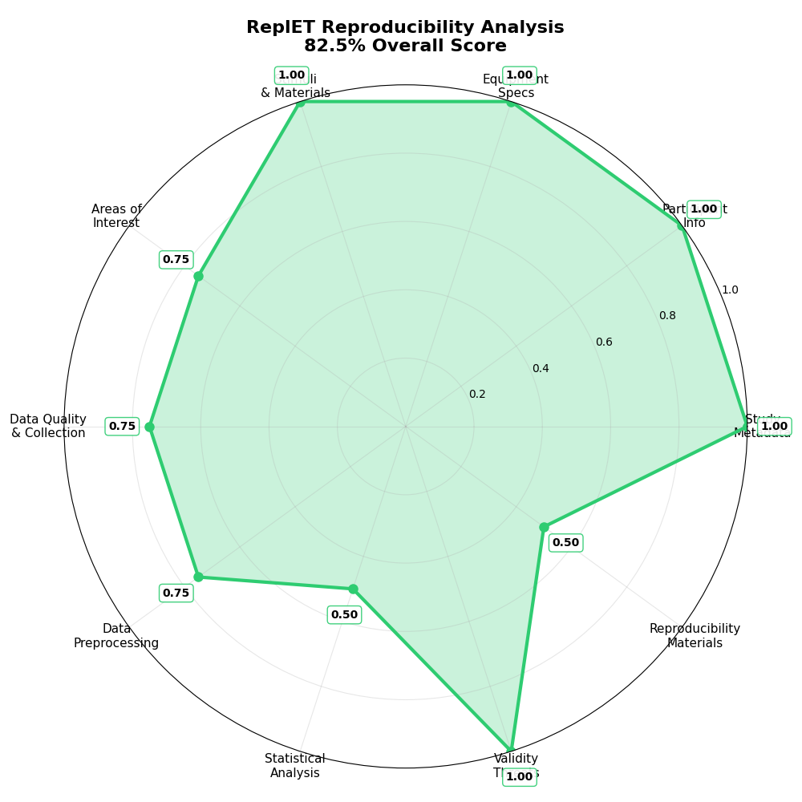

# replt.et EMIP: EMIP Dataset in REPL.et Format

EMIP (Eye Movements in Programming) dataset converted to the standardized REPL.et format for reproducible eye-tracking research in software engineering.

## 📜 Attribution

This repository includes data from:

Bednarik, Roman, et al.  
*"EMIP: The eye movements in programming dataset."*  
Science of Computer Programming 198 (2020): 102520.  
https://doi.org/10.1016/j.scico.2020.102520  

Licensed under the [Creative Commons Attribution 4.0 International License](https://creativecommons.org/licenses/by/4.0/).

All original code, schemas, and documentation in this repository are also licensed under CC BY 4.0.

---

## 📋 Compliance Checklist

**Status**: Publication ready  
**Overall Compliance**: 8.75/10 criteria met (87.5%)

### Component Scores:
- ✅ **Study Metadata**: 100.0%
- ✅ **Participant Info**: 100.0%
- ✅ **Equipment Specs**: 100.0%
- ✅ **Stimuli & Materials**: 100.0%
- ⚠️ **Areas of Interest**: 75.0%
- ⚠️ **Data Quality & Collection**: 75.0%
- ⚠️ **Data Preprocessing**: 75.0%
- ❌ **Statistical Analysis**: 50.0%
- ✅ **Validity Assessment**: 100.0%
- ✅ **Reproducibility Materials**: 100.0%

### Legend:
- ✅ **Complete** (>80%): Publication ready  
- ⚠️ **Partial** (50-80%): Good progress, needs refinement  
- ❌ **Missing** (<50%): Requires attention  

---

## 📊 Reproducibility Spider Graph

| Study Component         | Score   |
|------------------------|---------|
| Study Metadata         | 100.0%  |
| Participant Info       | 100.0%  |
| Equipment Specs        | 100.0%  |
| Stimuli & Materials    | 100.0%  |
| Areas of Interest      | 75.0%   |
| Data Quality & Collection | 75.0% |
| Data Preprocessing     | 75.0%   |
| Statistical Analysis   | 50.0%   |
| Validity Assessment    | 100.0%  |
| Reproducibility Materials | 100.0%|
| **Overall Study Score**| **87.5%** |
