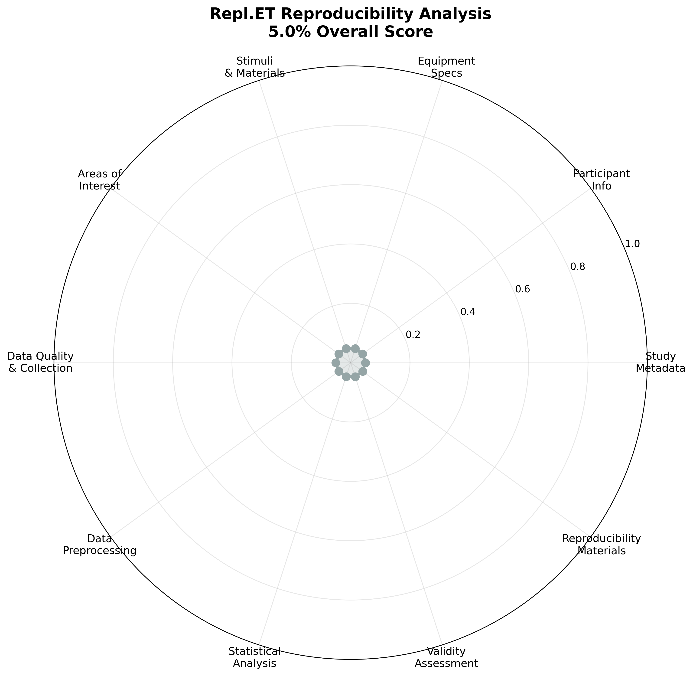

# replt.et EMIP: EMIP Dataset in REPL.et Format

EMIP (Eye Movement in Programming) dataset converted to the standardized REPL.et format for reproducible eye tracking research in software engineering.

## Template Compliance Analysis

Run `python3 utils/update_readme_with_assessment.py` to update this analysis with your current template status.

### Research Standards Compliance

```
TEMPLATE COMPLIANCE STATUS

FAIR Principles                    iGuidelines Compliance
├─ [ ] Findable (JSON + metadata)      ├─ [ ] Participant templates
├─ [ ] Accessible (open formats)       ├─ [ ] Calibration procedures  
├─ [ ] Interoperable (schemas)         ├─ [ ] Exclusion criteria
└─ [ ] Reusable (rich metadata)        └─ [x] Quality metrics

Research Standards                 TRRRACED Framework
├─ [ ] Study design templates          ├─ [ ] Transparent reporting
├─ [ ] Equipment specifications        ├─ [x] Replication materials
├─ [x] Stimuli documentation           ├─ [x] Data availability
├─ [x] Methodology transparency        └─ [ ] Environment specs  
└─ [ ] Validity assessment

COMPLIANCE STATUS: 4/17 criteria met
TEMPLATE STATUS: Empty Template  
RESULT: Fill template with real study data to achieve compliance
```

## Reproducibility Spider Graph



### Scores by Component

| Template Component | Score | Spider Graph Dimension |
|-------------------|-------|------------------------|
| `metadata.json` | 5% | Study Metadata |
| `participants/` | 5% | Participant Information |
| `equipment/` | 5% | Equipment Specifications |
| `stimuli/` | 5% | Stimuli & Materials |
| `aois/` | 5% | Areas of Interest |
| `collection/` | 5% | Data Quality |
| `preprocessing/` | 5% | Data Preprocessing |
| `analysis/` | 5% | Statistical Analysis |
| `validity/` | 5% | Validity Assessment |
| `reproducibility/` | 5% | Reproducibility Materials |

**Overall Template Score: 5.0%** (Empty Template - Fill with Real Study Data)

## Generate Updated Analysis

```bash
# Install requirements (one-time setup)
pip install matplotlib numpy

# Update this README with current template status
python3 utils/update_readme_with_assessment.py
```

## Citation

```bibtex
@software{silva2024replet,
  title = {Repl.ET: Eye Tracking Research Template},
  author = {Silva, Lucas},
  year = {2024},
  url = {https://github.com/fratelus/Repl.ET},
  version = {2.0.0},
  note = {Template for reproducible eye tracking research}
}
``` 