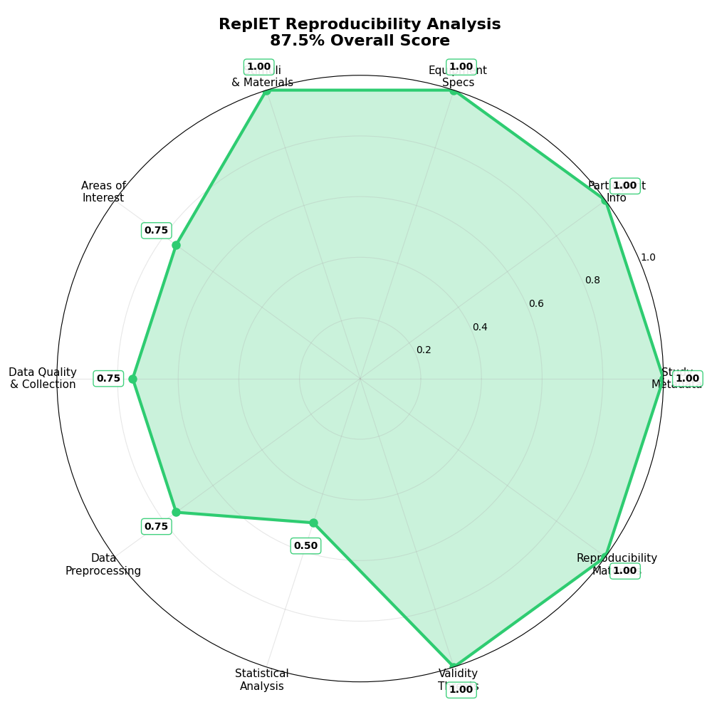

# replt.et EMIP: EMIP Dataset in REPL.et Format

EMIP (Eye Movement in Programming) dataset converted to the standardized REPL.et format for reproducible eye tracking research in software engineering.

## Template Compliance Analysis

## 📋 Compliance Checklist

**Status**: In Progress (Good Progress)  
**Overall Compliance**: 6/10 criteria met (60.0%)

### Component Scores:
- ✅ **Study Metadata**: 100.0%
- ✅ **Participant Info**: 100.0%
- ✅ **Equipment Specs**: 100.0%
- ✅ **Stimuli & Materials**: 100.0%
- ⚠️ **Areas of Interest**: 75.0%
- ⚠️ **Data Quality & Collection**: 75.0%
- ⚠️ **Data Preprocessing**: 75.0%
- ❌ **Statistical Analysis**: 50.0%
- ✅ **Validity Assessment**: 100.0%
- ✅ **Reproducibility Materials**: 100.0%

### Legend:
- ✅ **Complete** (>80%): Publication ready
- ⚠️ **Partial** (50-80%): Good progress, needs refinement  
- ❌ **Missing** (<50%): Requires attention

---
## Reproducibility Spider Graph

| Study Component | Score |
|----------------|-------|
| Study Metadata | 100.0% |
| Participant Info | 100.0% |
| Equipment Specs | 100.0% |
| Stimuli & Materials | 100.0% |
| Areas of Interest | 75.0% |
| Data Quality & Collection | 75.0% |
| Data Preprocessing | 75.0% |
| Statistical Analysis | 50.0% |
| Validity Assessment | 100.0% |
| Reproducibility Materials | 100.0% |
| **Overall Study Score** | **87.5%** |

