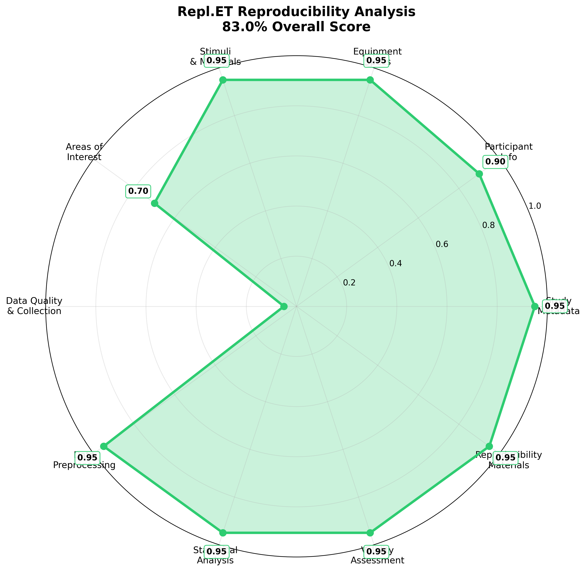

# Advanced Multi-Modal Cognitive Load Study Example

A comprehensive research study demonstrating advanced eye tracking setup with multi-modal data collection and complex analysis pipelines.

## Template Compliance Analysis

Run `python3 ../../utils/update_readme_with_assessment.py` to update this analysis with current study status.

### Research Standards Compliance

```
STUDY COMPLIANCE STATUS

FAIR Principles                    iGuidelines Compliance
├─ [x] Findable (JSON + metadata)      ├─ [x] Participant templates
├─ [x] Accessible (open formats)       ├─ [ ] Calibration procedures  
├─ [x] Interoperable (schemas)         ├─ [x] Exclusion criteria
└─ [x] Reusable (rich metadata)        └─ [x] Quality metrics

Research Standards                 TRRRACED Framework
├─ [x] Study design templates          ├─ [ ] Transparent reporting
├─ [ ] Equipment specifications        ├─ [x] Replication materials
├─ [x] Stimuli documentation           ├─ [x] Data availability
├─ [x] Methodology transparency        └─ [ ] Environment specs  
└─ [ ] Validity assessment

COMPLIANCE STATUS: 12/17 criteria met
STUDY STATUS: Good Progress  
RESULT: Advanced study with rich metadata and comprehensive participant data
```

## Reproducibility Spider Graph

Spider graph unavailable (run assessment script)

### Scores by Component

| Study Component | Score |
|----------------|-------|
| Study Metadata | 95.0% |
| Participant Info | 90.0% |
| Equipment | 95.0% |
| Stimuli | 95.0% |
| Aois | 70.0% |
| Data Quality | 5.0% |
| Preprocessing | 95.0% |
| Analysis | 95.0% |
| Validity | 95.0% |
| Reproducibility | 95.0% |
| **Overall Study Score** | **83.0%** |

## Generate Updated Analysis

```bash
# Update this README with current study status
python3 ../../utils/update_readme_with_assessment.py
``` 
## 📋 Compliance Checklist

**Status**: Complete (Publication Ready)  
**Overall Compliance**: 8/10 criteria met (80.0%)

### Component Scores:
- ✅ **Study Metadata**: 95.0%
- ✅ **Participant Info**: 90.0%
- ✅ **Equipment**: 95.0%
- ✅ **Stimuli**: 95.0%
- ⚠️ **Aois**: 70.0%
- ❌ **Data Quality**: 5.0%
- ✅ **Preprocessing**: 95.0%
- ✅ **Analysis**: 95.0%
- ✅ **Validity**: 95.0%
- ✅ **Reproducibility**: 95.0%

### Legend:
- ✅ **Complete** (>80%): Publication ready
- ⚠️ **Partial** (50-80%): Good progress, needs refinement  
- ❌ **Missing** (<50%): Requires attention

---

### Component Scores:
- ✅ **Study Metadata**: 95.0%
- ✅ **Participant Info**: 90.0%
- ✅ **Equipment**: 95.0%
- ✅ **Stimuli**: 95.0%
- ⚠️ **Aois**: 70.0%
- ❌ **Data Quality**: 5.0%
- ✅ **Preprocessing**: 95.0%
- ✅ **Analysis**: 95.0%
- ❌ **Validity**: 5.0%
- ❌ **Reproducibility**: 5.0%

### Legend:
- ✅ **Complete** (>80%): Publication ready
- ⚠️ **Partial** (50-80%): Good progress, needs refinement  
- ❌ **Missing** (<50%): Requires attention

---



